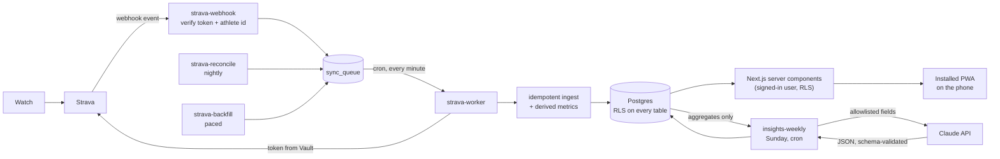

<p align="center">
  
</p>

<p align="center">
  
</p>

<h1 align="center">iRun</h1>

<p align="center"><strong>A phone cockpit for your running.</strong><br/>
Strava runs, heart rate and gym sessions, turned into one-glance numbers and a weekly insight to act on.</p>

<p align="center">
  
  
  
  
  
  
  
  
  
  
</p>

---

## Purpose

iRun is a **single-user** running app. One account, no feed, no other athletes. Its one job is to answer: *did my latest run move me toward my goal?*

A run recorded on a watch lands on Strava, then on the **Today** screen within about five minutes, with pace, heart rate, route and how it compares to the last similar run. No manual entry.

### Principles

| Value                    | What it means in the product                                                                                                        |
| ------------------------ | ----------------------------------------------------------------------------------------------------------------------------------- |
| **Visual first**         | Charts, gauges, cards with one big number. Text is a caption, never the content.                                                    |
| **Easy values to use**   | Every number answers "is this good, and what do I do?" with a status color, an icon, a word, and a delta against your own baseline. |
| **Flowy and in control** | Few taps, thumb-reachable, one obvious action per screen.                                                                           |
| **Honest data**          | Source and freshness on every metric. A failed sync is never hidden. The app says "Collecting data" instead of drawing a fake trend. |
| **Secure by default**    | One account, 2FA enforced, row-level security everywhere, secrets never near the browser.                                           |

### The five screens

| Screen       | What it answers                                                                                                                                                                                                           |
| ------------ | ------------------------------------------------------------------------------------------------------------------------------------------------------------------------------------------------------------------------- |
| **Today**    | Latest run (distance, pace, heart rate, route), the delta versus the last similar run, this week against a target band, the 5k goal ring.                                                                                 |
| **Runs**     | Every run, filtered by Easy / Tempo / Long / Intervals, with a pace sparkline. **Loops** are detected automatically from your routes. Run detail has a pace and heart-rate chart you can scrub, splits, zones, elevation. |
| **Trends**   | "Am I building volume?" Weekly km, a 4-week average and a target band. Best efforts (exact and equivalent), pace-distance curve, efficiency.                                                                              |
| **Insights** | A weekly set of cards (Progress, Risk, Coach), each with a value, a delta, one concrete action, a confidence level and its source.                                                                                        |
| **Strength** | Gym sessions from Strava, leg-day spacing against a 24 h mark, and one calendar for runs and strength.                                                                                                                    |

Goals (5k pace, 10k pace, a custom distance) and the weekly target band are set in **Settings**.

---

## Tech stack

| Layer         | Choice                                                                                         |
| ------------- | ---------------------------------------------------------------------------------------------- |
| App           | Next.js 16 (App Router, `proxy.ts`), React 19, TypeScript 5                                    |
| UI            | Tailwind CSS 4, Radix + Base UI primitives, Framer Motion, Recharts, Vaul (sheets)             |
| Data and auth | Supabase: Postgres with RLS, Auth (TOTP / AAL2), Vault, `pg_cron`                              |
| Server logic  | Supabase Edge Functions on Deno (OAuth, webhook, worker, backfill, reconcile, weekly insights) |
| Validation    | Zod                                                                                            |
| Integrations  | Strava API (OAuth + webhook), Claude API (weekly insights)                                     |
| Hosting       | Vercel (web), Supabase (database + functions)                                                  |
| Tooling       | pnpm 10, Node 22, ESLint 9                                                                     |

---

## How it works

Strava is an **input**, not a database. Every activity is fetched once, stored in Postgres, and every screen reads from Postgres only.



**The path of one run**

1. The watch uploads the run to Strava. Strava calls the **webhook** Edge Function.
2. The webhook answers fast and queues the event. It only accepts events whose athlete id matches the stored owner, and it **never trusts the event body as data**.
3. The **worker** (a one-minute cron) takes the queue row, reads the Strava token from **Vault**, and re-fetches the activity and its streams from Strava.
4. **Ingest is idempotent** on `(user, source, source_id)`. Re-sending an activity updates it and never duplicates it. An API row always replaces an archive row, never the reverse.
5. **Derived metrics** are computed once per ingest: per-km splits, heart-rate zones, HR-based load, efficiency index, best efforts (exact, equivalent via Riegel, and whole-run), and loop signatures.
6. The Next.js server components read the result under the signed-in user's RLS policy.

**Edge Functions**

| Function           | Job                                                                    |
| ------------------ | ---------------------------------------------------------------------- |
| `strava-oauth`     | Connect and disconnect Strava. Tokens go straight into Vault.          |
| `strava-webhook`   | Subscription validation and event intake, strict schema and size caps. |
| `strava-worker`    | Drains the queue, fetches, ingests, derives. Retries with backoff.     |
| `strava-backfill`  | Paced history import that reads Strava's rate-limit headers.           |
| `strava-reconcile` | Nightly sweep of the last 7 days to fill any webhook gaps.             |
| `insights-weekly`  | Weekly AI cards from aggregates only, with a monthly token budget.     |

**Notable design decisions**

- **Loop detection** clusters runs whose routes overlap (85% of sampled points within 60 m), whose distances are within 6%, and whose starts match. Loops that start and end at home rarely hit exactly 5 or 10 km, so this is how a 9.4 km loop effort gets compared fairly.
- **Equivalent efforts** are labelled as estimates and never overwrite an exact personal best.
- **Token rotation is serialized.** Strava rotates the refresh token on every refresh, so refresh runs through one path with a row lock and saves the new token in the same transaction.
- **AI explains, rules decide.** Insight output is strict JSON validated against a schema. Invalid output is discarded and retried once, then the screen says "No insight this week".

---

## Run it

You bring your own Supabase project, Strava API application and (optionally) Claude API key.

### Prerequisites

Node 22, pnpm 10, Docker (for the local Supabase stack), and a free [Strava API application](https://www.strava.com/settings/api). A Claude API key is optional and only needed for Insights.

### Locally

```bash
pnpm install
cp env.example .env.local        # fill in the two public values
pnpm db:start                     # local Supabase (Postgres, Auth, Vault, functions)
pnpm db:reset                     # applies supabase/migrations
pnpm dev                          # http://127.0.0.1:3000
```

Public sign-up is **disabled by design**, so create the single owner account with the helper script, then enroll an authenticator app at `/mfa/enroll`:

```bash
SUPABASE_URL=... SUPABASE_SERVICE_ROLE_KEY=... pnpm tsx scripts/create-owner.ts
```

Then open **Settings → Connect Strava**. The Strava, webhook and Claude secrets belong to the **Edge Functions**, never to `.env.local` or Vercel.

### Configuration

| Variable                        | Where                | Purpose                                                 |
| ------------------------------- | -------------------- | ------------------------------------------------------- |
| `NEXT_PUBLIC_SUPABASE_URL`      | Web app              | Your Supabase project URL                               |
| `NEXT_PUBLIC_SUPABASE_ANON_KEY` | Web app              | Your Supabase anon (publishable) key                    |
| `STRAVA_CLIENT_ID`              | Edge Function secret | Strava application id                                   |
| `STRAVA_CLIENT_SECRET`          | Edge Function secret | Strava application secret                               |
| `STRAVA_WEBHOOK_VERIFY_TOKEN`   | Edge Function secret | Random string you choose, checked on every webhook call |
| `APP_ORIGIN`                    | Edge Function secret | Public URL of the web app, used for OAuth redirects     |
| `ANTHROPIC_API_KEY`             | Edge Function secret | Optional. Enables weekly Insights                       |
| `INSIGHTS_MODEL`                | Edge Function secret | Optional. Model used for Insights                       |
| `INSIGHTS_MONTHLY_TOKEN_BUDGET` | Edge Function secret | Optional. Monthly token cap for Insights                |

### Hosted (Vercel + Supabase)

1. Create a Supabase project. Turn **sign-up off** and **TOTP on**. Apply migrations with `pnpm exec supabase db push`.
2. Deploy the functions with `pnpm exec supabase functions deploy` and set their secrets with `supabase secrets set`.
3. Store `worker_service_key` and `project_url` in Vault so the cron jobs can call the functions.
4. Import the repo into Vercel and set only the two public variables.
5. Subscribe the Strava webhook once: `pnpm tsx scripts/subscribe-webhook.ts`, with `STRAVA_WEBHOOK_CALLBACK_URL` set to the deployed webhook address.

### Run it on your phone

iRun is an **installable web app**, not an app-store app. Its manifest opens straight onto Today in a standalone window.

1. Deploy it, or expose your dev server over HTTPS.
2. Open the URL in the phone's browser and sign in with your password and authenticator code.
3. **iPhone (Safari):** Share → *Add to Home Screen*. **Android (Chrome):** menu → *Install app*.
4. Launch it from the home screen like any app. Pull down to refresh.

It needs a connection. There is deliberately no offline cache.

---

## Security

Health data is sensitive, so the defaults are strict.

**Access**

- Public sign-up is off. There is one account.
- **TOTP 2FA is enforced.** `proxy.ts` routes anyone below AAL2 to the sign-in or MFA step before any app page loads, and RLS checks it again at the database.
- **Row-level security on every table** (`user_id = auth.uid()`).
- The Supabase service-role key exists only inside Edge Functions.

**Strava**

- Access and refresh tokens are encrypted in **Supabase Vault**, readable only by Edge Functions, and removed on disconnect.
- Webhook bodies are unsigned, so the function checks a secret verify token and the stored athlete id, then **re-fetches** the data from Strava. Delete and deauthorize events are **confirmed with Strava** before anything is removed.
- Scope is `activity:read_all` only. No write scope is requested.

**AI**

- Claude is called only from an Edge Function, never from the browser.
- The prompt builder uses an **explicit allowlist of aggregate fields**. Raw streams, routes, loop signatures and names cannot reach it.
- Model output is schema-validated. There is a monthly token budget and a daily manual-refresh limit.

**Web and data**

- Strict headers: CSP, HSTS (2 years, preload), `nosniff`, `frame-ancestors 'none'`, strict referrer policy, and a Permissions-Policy that denies camera, microphone and geolocation.
- No health data in logs, error messages or analytics. There is no third-party analytics.
- Settings has **Export all my data** and **Delete all my data**.

**Honest limits**

- The CSP still allows `'unsafe-inline'` for scripts and styles, because Next 16.3 has no nonce configuration and the charts and icons need inline styles.
- Strava keeps a copy of every activity, and Strava's terms apply to the data.
- Aggregated stats (not raw routes) are sent to Anthropic to write the weekly insights.

---

## Repository map

```
app/          Next.js routes: (app)/today, runs, trends, insights, strength, settings; login, mfa
components/   UI primitives, charts, screens
lib/          Data access, auth levels, formatting, archive parsing
supabase/     Migrations and Edge Functions (+ _shared metrics, ingest, insights)
scripts/      One-time setup: create-owner, subscribe-webhook
public/       Icons and brand assets
```

## License

MIT. See [LICENSE](LICENSE).
